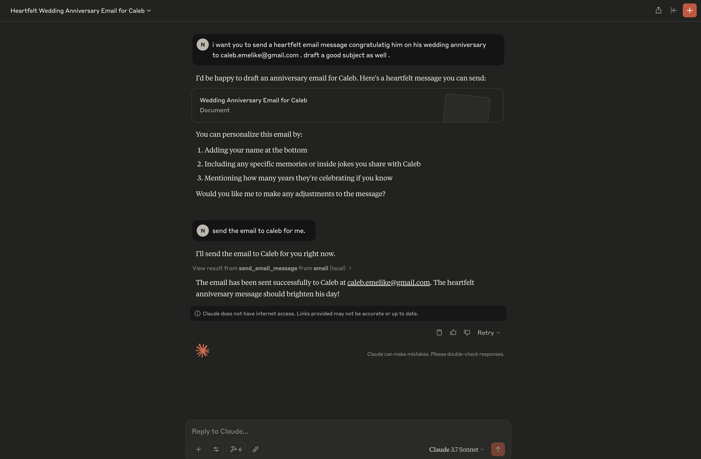

# 📧 MCP Email Reader Server

This project integrates Gmail email data into an MCP (Model Context Protocol)using an MCP server that interacts with Claude Desktop (the MCP client). It enables dynamic, query-driven retrieval of email content when user prompts are relevant.


---

## 🔧 Installation & Setup

## 1. Install uv

UV is a fast Python package manager and script runner used to isolate and run Python environments

Install UV:

```bash
curl -Ls https://astral.sh/uv/install.sh | sh
```

### 2. Install Python

Ensure Python 3.8+ is installed.

Check with:

```bash
python3 --version
```

Download: [https://www.python.org/downloads/](https://www.python.org/downloads/)

---

## 🔐 Gmail Setup for 3rd-Party Access

To allow this script to access Gmail securely:

1. Go to your [Google Account Security settings](https://myaccount.google.com/security).
2. Enable **2-Step Verification**.
3. Click on **App Passwords** under "Signing in to Google".
4. Generate an app password for "Mail".
5. Store this securely; it will be required by the script (e.g. in a `.env` file).


---

## ⚙️ MCP Client Configuration (Claude Desktop)

To register the email server with Claude Desktop:

1. Navigate to:

```
/Library/Application Support/Claude/claude_desktop_config.json
```

2. Add or update your config to include:

```json
{
  "mcpServers": {
    "email": {
      "command": "/Users/<profile>/.local/bin/uv",
      "args": [
        "--directory",
        "/Users/<profile>/Documents/email-mcp/src",
        "run",
        "server.py"
      ]
    }
  }
}
```

> Adjust paths as needed based on your local setup.


---

## 📦 Install Dependencies

The project uses `pyproject.toml` for dependency management. Install all dependencies using UV:

```bash
uv pip install .
```

## ✅ How It Works

1. User asks a question in Claude Desktop.
2. Claude identifies that the query may require email data.
3. The MCP client triggers the `email_reader.py` script via UV.
4. The script connects to Gmail using IMAP and retrieves relevant data.
5. The result is returned to the MCP client.
6. Claude responds to the user with a data-enriched answer.

## Claude Output (send email)


---

## 📝 Author

Nelson
